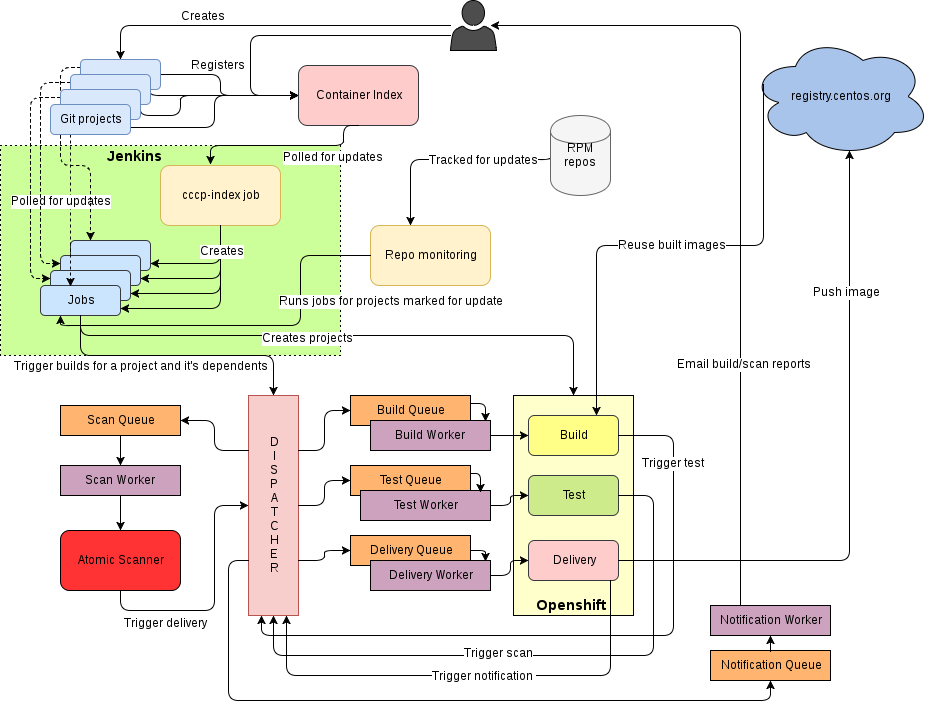

# CentOS Community Container Pipeline

| Last PR Build | [](https://ci.centos.org/view/Container/job/centos-container-pipeline-service-ci-pr/) |
|---------------|---------------------------------------------------------------------------------------------------------------------------------------------------------------------------------------------------|

CentOS Community Container Pipeline(cccp) is a service, to provide any Open Source developer(s), a platform for containerising their application(s). This process builds the application(s) from any arbitary git repository/repositories, package the built application along with its runtime in a container image, tests the image with help of test script and delivers to a publicly available registry. A user can anytime pull the tested image from that registry.

## User Story

I, as an application developer want to build, test and deliver my containerized application images so that I can focus on development and be sure images are always available and working for the app users.

## Key parts

We want to provide a single input interface to the system (pipeline index) and don't limit ourselves in ways how to deliver the image (i.e. in case of Docker to push to any registry accessible from the pipeline infra). We want to build an image provided by a user, we want to test it with a predefined set of tests and with tests provided by user, we want to deliver the image (i.e. push it to registry) and present logs in case of failures.



1. Input Interface
    * A web UI/cli which allows user to provide at least name of the project and repo URL.
    * This project tracks [Container Index](https://github.com/CentOS/container-index/blob/master/index.d) as input to the build system.
2. OpenShift
    * **Build** - Can be Atomic Reactor, result: image tagged as :test pushed
    * **Test** - Can be a script connecting to Jenkins, result: image tagged as :rc pushed
    * **Delivery** - A simple script to re-tag image to it's final name, result: image tagged as :latest or :vX.Y.Z pushed
3. Jenkins/CI
    * Infra where **Test** step in OpenShift connects to
4. Registry
    * Pulp or a registry provided by OpenShift, deployed at https://registry.centos.org/
5. Failure UI
    * Probably part of Input Interface, presenting logs from failed builds
6. Scan
    * Scan uses [atomic scan] (https://github.com/projectatomic/atomic) tooling, multiple atomic scanners are run on built images and different checks are done, checking if image has outdated RPM, npm, pip packages and if image has tampered files present, etc.

## Setting a development environment

### Vagrant

### Setup environment

#### CentOS
```
# Install dependencies
sudo yum install -y epel-release git
sudo yum install -y ansible1.9 centos-release-scl qemu-kvm libvirt sclo-vagrant1

# start libvirtd
sudo systemctl start libvirtd; sudo systemctl enable libvirtd

# enable bash on vagrant scl
sudo scl enable sclo-vagrant1 bash
```

#### Fedora
```
# sudo dnf install -y git ansible vagrant
```

### Get the code and install vagrant plugins

```
git clone https://github.com/CentOS/container-pipeline-service
cd container-pipeline-service
```

### Get started

#### Single node setup

```
ALLINONE=1 vagrant up
```

#### Multi node setup

```
vagrant up
```

### Setup on generic hosts

This will allow to setup single or multi node setup of container pipeline
on various kinds of hosts, any host that is accessible over SSH, be it, a
baremetal, a VPS, cloud or local VM, etc.

```
cd provisions

# Copy sample hosts file and edit as needed
cp hosts.sample hosts

# Provision the hosts. This assumes that you have added the usernames,
# passwords or private keys used to access the hosts in the hosts file
# above
ansible-playbook -i hosts vagrant.yml
```
